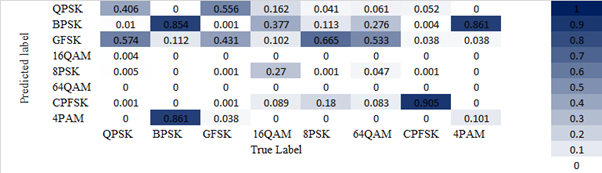

# DSTA Internship Project: RF Signal Classification using Deep Learning on the edge
## Abstract

We demonstrate the embedded implementation of a deep learning-based RF modulation classifier that is implemented on the embedded ARM CPU of the Raspberry Pi 2 connected to the software-defined radio (SDR) platform, ADALM-PLUTO. Supported by low-power embedded computing, the received signals are classified to different modulation types in real-time. The deep neural network that is used for the RF signal classifier runs directly on the Raspberry Pi without an external Internet connection. In the demonstration setup, a HackRF One radio transmits signals with different modulation types and ADALM-PLUTO with Raspberry Pi classifies each received signal (I/Q samples) to its modulation type. 

## Aims

This project aims to focus on the practical application of deep learning-based RF modulation classifiers in the field. The typical practice for modulation classification with deep learning is to use either simulated or over-the-air captured signals for testing and training purposes, while the underlying computation is performed off-line with central processing unit (CPU) or graphics processing unit (GPU) resources without answering the needs of embedded (on-device) computation. However, for some real-time applications that need to make a quick decision in microseconds timeframe, the latency to move the data to the cloud for deep learning is not feasible. To that end, we investigated the feasibility of performing classification on the embedded device itself. Additionally, we will investigate the performance of a model trained on a synthetic dataset on real-life RF samples.

## Results

## Findings

In conclusion, the model’s impressive performance on the synthetic RadioML dataset did not translate to good performance when raw samples from the ADALM-PLUTO were classified. While the model used demonstrated impressive performance on the synthetic RadioML dataset, this did not translate to good performance when raw samples from the ADALM-PLUTO were classified. This could be because, in the real world, it is impossible to control how much noise is being detected by the receiver. Uncontrollable environmental factors such as temperature and position of the receiver can affect the SNR of the signal received, explaining the bad performance of the model. In contrast, the RadioML dataset that the model was trained on was much cleaner as compared to the real-life samples collected. 

## Report

A copy of the report can be found [here](Report.pdf)